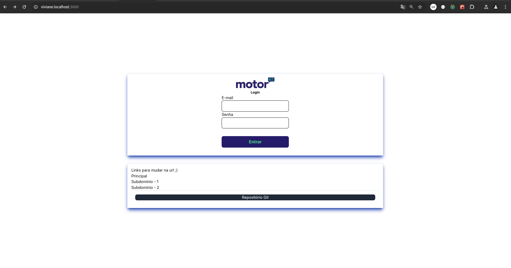
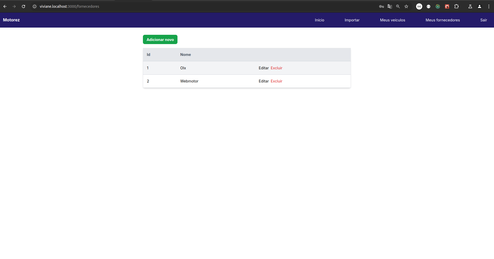
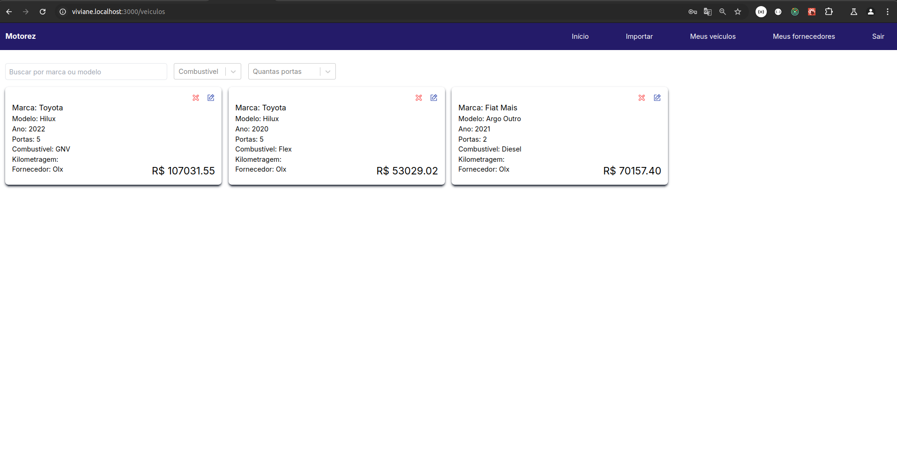

## Front End

### Tecnologias e bibliotecas usadas no Front End:
- `nextui-org`
- `sweetalert2`
- `react-hook-form`
- `nookies`
- `axios`
- `@svgr/webpack`
- `react-toastify`

### Outros Tópicos:
- Consultas ao banco de dados otimizadas com recurso de debounce para melhorar a eficiência das consultas.

### Fluxo de Usabilidade:
1. O usuário faz login com suas credenciais.
2. O usuário carrega um arquivo XML ou JSON, e o sistema transforma esse arquivo em objeto para facilitar a leitura no PHP.
3. O usuário acessa a listagem dos dados carregados no sistema.

>`Tela de Login`
- Foram adicionados links de informações e a opção para troca de subdomínios nas rotas dos dois clientes tenants cadastrados via seeders.

>`Tela de Fornecedores`
- Na tela de fornecedores, é possível cadastrar e listar os fornecedores. Um detalhe importante é que só é possível excluir um fornecedor se ele não tiver registros de veículos associados, importados em outro momento.

>`Tela de Veículos`
- Na tela de veículos, é possível listar os veículos, atualizar um veículo já adicionado (apenas a marca e o modelo podem ser alterados), e também excluir um veículo.

Por favor, considere comentar a linha 8 do docker-compose -> platform: linux/arm64/v8, quando for rodar esse projeto em arquitetura diferente de arm64/v8, se seu computador já tiver o Node V18 instalada 
você simplesmente instala as dependencias e depois axecuta o comando ---> npm run dev
